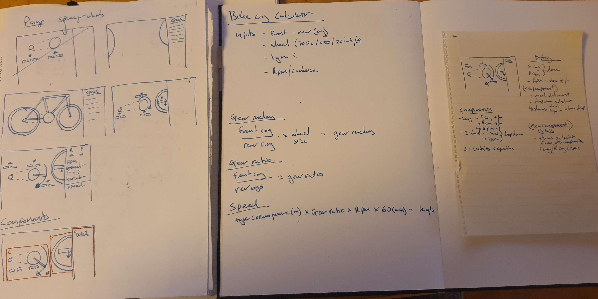

# Project outline

This is a project that is being built up using TDD at is core to build and develope the product.

The goal is to create a simple speed caculator for cyuclist to show the users statistics basesd on the selected set up.

Inputs:

- Rear and Front cog size, change up or down by one.
- Select Wheel and Tyre size.
- Pedaling RPM

Outputs:

- Speed , Gear Ratios, cog sizes, wheel and tyre sizes

## Equations

Gear Inches:
Front cog / Rear cog x wheel sizer (inc tyre) = Gear Inches

Gear Ratio:
Front cog / Rear cog = Gear Ratio

Speed:
Tyre Cuircumferance(m) x Gear Ratio x RPM x 60(mins) = Km/h

## Technology

I have used Typescript on a Next.js framework with Jest for testing.

There were other potential testing frameworks that may be included later like Espresso but currently Jest is covering all required types from unit testing to UAT testing.

## Getting Started

Clone the Repo and then run the comands below

setup enviorment - $ yarn dev

Run tests - $ npx jest

## Planning

/_ eslint-enable _/
